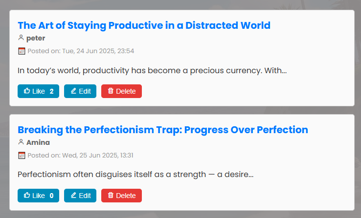
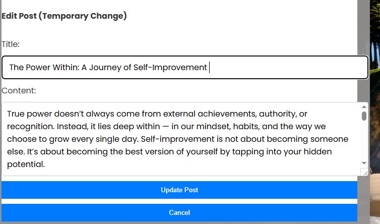

# Week-3-Code-Challenge (Simple Post Manager)

A dynamic and interactive blog post management app built with **HTML**, **CSS**, and **JavaScript**, powered by a mock backend using `json-server`. It allows users to create, view, edit, and delete blog posts with ease, all in a beautiful and responsive interface.

## 📁 Project Structure

Simple Post Manager/
├── index.html
├── css/
│ └── styles.css
├── images/
│ └── curling.jpeg
├── src/
│ └── index.js
└── db.json

## 📄 Description

This project simulates a simple blogging platform where users can:

- Create new blog posts
- View blog post details
- Edit existing posts
- Delete posts
- Like posts (client-side only)

Each post contains:

- A title
- Author's name
- Content
- A timestamp indicating when it was created

---

## ⚙️ Features

### ✅ Create a Post

Users can enter:

- Author Name
- Post Title
- Content

When the "Create" button is clicked:

- The post is saved to `db.json` using a `POST` request.
- It automatically appears in the post list below the form.
- The post preview shows the author, posting date, and a preview of the content.
- The form resets automatically after submission.

### 📝 View Post Details

- Clicking a post title displays full details in the Post Details section.
- The details include:

  - Full title
  - Author name
  - Complete content

### ✏️ Edit Post

- Clicking the "Edit" button opens a temporary edit form with the current title and content filled in.
- You can:

  - Update Post: Submits a `PATCH` request to update the backend and refreshes the display.
  - Cancel: Hides the form without saving changes.

### 🗑️ Delete Post

- Clicking **"Delete"** removes the post after a confirmation popup.
- A `DELETE` request is sent to `db.json`, and the UI updates to reflect the change.

### 👍 Like Post

- Each post has a **Like** button with a counter.
- Clicking it increments the count on the spot (client-side only, no backend update).

## 🚀 How It Works

1. Page Load:

   - When the page loads, it sends a `GET` request to fetch all posts from `http://localhost:3000/posts` and renders them.

2. Creating a Post:

   - Submits a `POST` request to `API_URL` with:

     ```json
     {
       "title": "Post Title",
       "author": "Author Name",
       "content": "Your content",
       "timestamp": "2025-06-25T10:59:00Z"
     }
     ```

3. Editing a Post:

   - Clicking Edit loads the post data into a hidden edit form.
   - On update, a `PATCH` request is sent to:

     ```
     http://localhost:3000/posts/{id}
     ```

     with the updated content.

4. Deleting a Post:

   - A confirmation box appears.
   - If confirmed, a `DELETE` request is sent to:

     http://localhost:3000/posts/{id}

## 🖱️ Button Functionality Explained

| Button      | Function                                                                 |
| ----------- | ------------------------------------------------------------------------ |
| Create      | Sends the post data to the backend and refreshes the post list.          |
| Edit        | Reveals a form below the post detail area allowing temporary editing.    |
| Update Post | Applies the edits using a `PATCH` request and refreshes UI.              |
| Cancel      | Hides the edit form without applying changes.                            |
| Delete      | Permanently removes the post after a confirmation.                       |
| Like        | Increments a local like count (not saved to backend).                    |
| Post Title  | Clicking it displays the full post content in the **Post Details** pane. |

## 📦 Technologies Used

HTML – for structure
CSS – for styling and layout
JavaScript – for interactivity and API communication
json-server – mock backend for RESTful API

📡 How to Run This Project Locally

1. Clone this repo:

   ```bash
   git clone https://github.com/peter2610/Week-3-Code-Challenge.git
   cd Week-3-Code-Challenge
   ```

2. Install `json-server`:

   ```bash
   npm install -g json-server
   ```

3. Create or ensure `db.json` exists with sample data:

   ```json
   {
     "posts": []
   }
   ```

   you will see
   {
   "posts": [
   {
   "id": "83af",
   "title": "The Art of Staying Productive in a Distracted World",
   "content": "In today’s world, productivity has become a precious currency. ......",
   "author": "peter",
   "timestamp": "2025-06-24T20:54:15.321Z"
   },
   remember to click (tick) on pretty-print

4. Start the server:

   ```bash
   json-server --watch db.json
   ```

   It runs on: `http://localhost:3000/posts`

5. Open `index.html` in your browser using [Live Server](https://marketplace.visualstudio.com/items?itemName=ritwickdey.LiveServer) or manually.

---

## 📸 Sample Output

### Post Form:

```
Author Name: peter
Title: The Art of Staying Productive in a Distracted World
Content: In today’s world, productivity has become...
```

### On Submit:

```
📝 Title: The Art of Staying Productive...
👤 Author: peter
📅 Posted on: Tue, 24 Jun 2025, 23:54
```



## 💡 key Notes

Edit only changes title and content (not author or date).
Likes are temporary and reset on reload.
Uses native JS (no frameworks).
Responsive design for mobile screens.


## 🧑 Author

Peter Munyambu
GitHub: [peter2610](https://github.com/peter2610)
